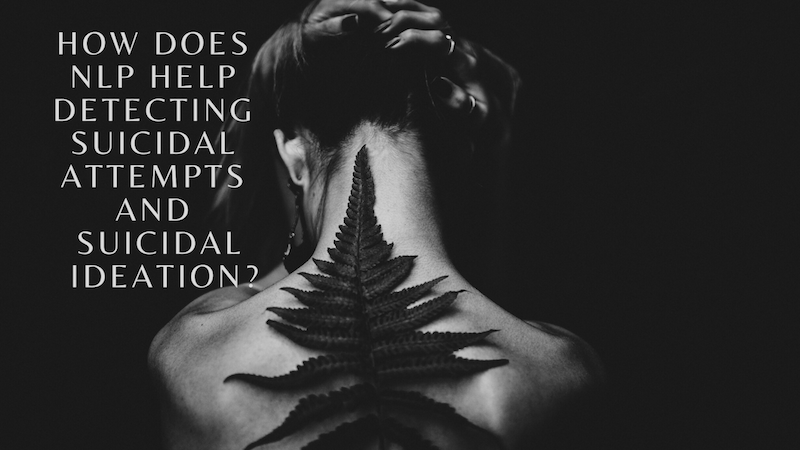
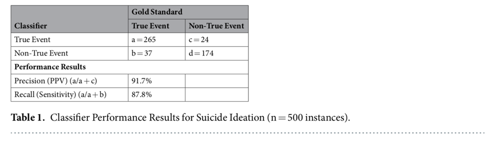
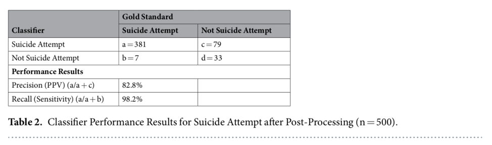

Reference: [Identifying Suicide Ideation and Suicidal Attempts in a Psychiatric Clinical Research Database using Natural Language Processing](https://www.nature.com/articles/s41598-018-25773-2)

    <h1>
        

Summary of:
"Identifying Suicide Ideation and Suicidal Attempts in a Psychiatric Clinical Research Database using Natural Language Processing" Research Paper. 
        

    </h1>

  [Datalytics with Alicja]()  
Alicja Wilk 12/9/2019

#### **Main Points learnt from the paper on how Machine Learning Models detect suicidal patients.**

The objective of this study is to describe the independent development of two NLP working approaches and to contribute to research on text mining methods used to identify suicidal behavior.

This research paper focused on two NLP approaches, one to classify the presence of suicide ideation (‘discussing a suicide with an intent to do it’) and second to identify suicide attempts (attempting self-harm with an intention to die). First one is a rule-based model and second is a hybrid of machine learning and rule-based.

Using Machine Learning algorithm to detect suicidal patients is a relatively new approach in the psychiatric space. This research is one of a very few in the space which presents numerous opportunities for future research in order to detect and help people with mental illness. 

In the paper the authors first list challenges that this space is presented with: 
-	Relative rarity of the event 
-	Short observation periods 
-	Recall bias – when we are detecting people that indeed were suicidal very well but incorrectly detecting ones that were not suicidal. (in other words – model classifies most people as suicidal)

A few research papers described using text search and random forest to identify suicide attempts. Other, more recent papers described SVMs, association rules, decision trees, logistic regression, Naïve Bayes, random forest and neural as good models to classify suicidal ideation from suicidal attempt and, in general, to identify self-harm behavior. 

Evaluation results of both approaches: 

This is an extremely valuable research that help with detecting suicidal notes using CRIS (The Clinical Record Interactive Search). There are over 1 million records in the database. The NLP models were able to extract significant data with high precision, recall and F1 scores. 

This research paper creates space for others to utilize when working with psychiatric data.

